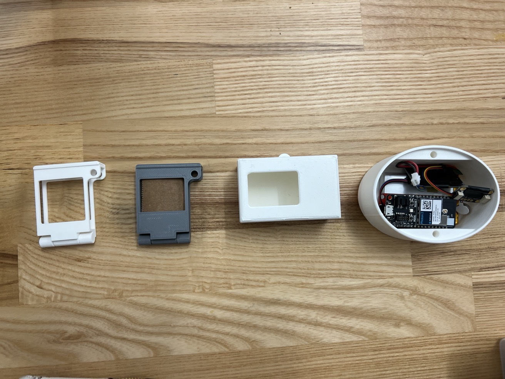
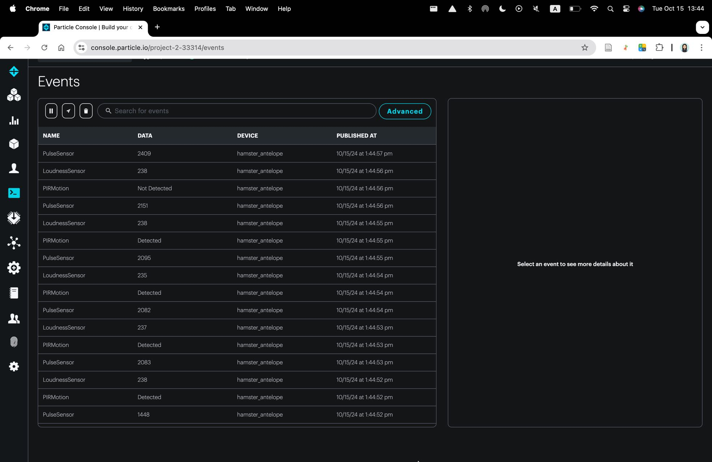
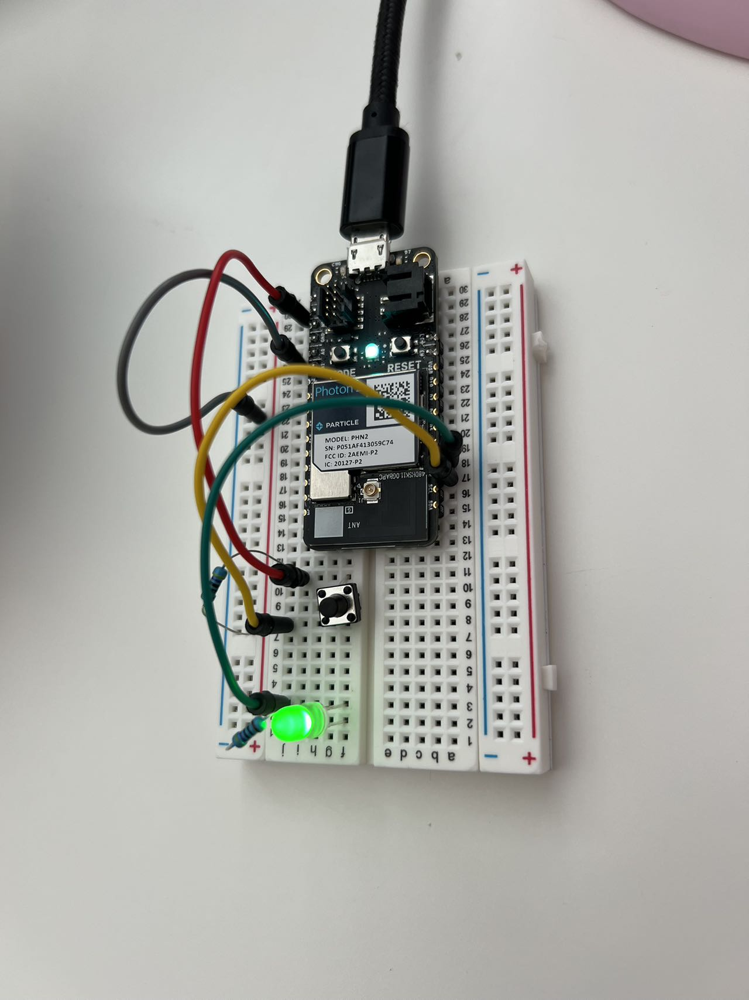

# Hello!
Welcome to Darlene's GitHub repository🌸

# Outline
[Week 1 (9/2)](README.md#week-1-weekly-report-1), [Week 2 (9/9)](README.md#week-2-weekly-report-2), [Week 3 (9/16)](README.md#week-3-weekly-report-3), [Week 4 (9/23)](README.md#week-4-weekly-report-4), 
[Week 5 (9/30)](README.md#week-5-weekly-report-5), [Week 6 (10/7)](README.md#week-6-weekly-report-6), [Week 7 (10/14)](README.md#week-7-weekly-report-7), [Week 8 (10/21)](README.md#week-8-weekly-report-8), [Week 9 (10/28)](README.md#week-9-weekly-report-9)

---

# Week 9: Weekly Report 9 #
## Week of 10/28/2024
### Reflections
This week, we wrapped up the last project and started Project 3: Retrieval Augmented Generation LLM. In the first class, we met Pete and were introduced to Zerowidth, which we will use to train on LLM. I enjoyed exploring training the LLM and designing a "mini-me" bot to answer questions for me. Through the process, I learned a lot of terms like temperature and token. 

By following the four experiments in the tutorial, I also familiarized myself with the tool Zerowidth and learned about editing agent flows, adding knowledge base, and so on. 

### Speculations
I personally feel like leveraging tools like Zerowidth has made AI design more friendly to people without much technical background.

---

# Week 8: Weekly Report 8 #
## Week of 10/21/2024
### Reflections
This is the final week for Project 2, and our team has made a lot of progress. Specifically, we spent most of the time getting the two outputs—OLED display and vibration motor—to work properly. I mainly focused on working with the haptic motor controller board and the vibrating mini motor. I first soldered the two components together, then followed the tutorial, and worked with the instructors during class to flash the correct codes.  
  
  
We also had group work sessions to finalize the physical prototyping and video content. We tried various iterations of the case, ensuring that all hardware components fit inside. We also revised our diagram since we calculated the BPM by ourselves instead of using a web health API. 
  
  

### Speculations
Along the way, we faced several challenges, such as reaching the maximum cloud storage, translating analog signals to BPM, being unable to connect to IoT Wi-Fi, and more. We supported each other throughout the process and asked peers in our cohort for help. I'm excited to receive feedback on our project and to wrap up the project report this weekend.

---

# Week 7: Weekly Report 7 #
## Week of 10/14/2024
### Reflections
This week, we started by refining our project proposal. Specifically, we added two new inputs for our ecosystem and re-created the diagrams.  
  
  
During Monday's class, we tried connecting all three inputs: pulse sensor, loudness sensor, and motion detector with Photon 2 on the breadboard. We successfully compiled and flashed the code. However, the pulse sensor outputs don't seem accurate the whole time, and we will look into it later.  
  
On Tuesday, we worked on publishing and subscribing data from Particle Cloud using a second Photon.  
  

### Speculations
Although we made a lot of progress, we were stuck on connecting to our first output—the OLED display on our Photon. We scheduled office hours with the instructor and planned to figure it out before the next class. Overall, I'm satisfied with what our team achieved within three days. Each member of our team has different strengths, and we were able to troubleshoot through our teamwork.

---

# Week 6: Weekly Report 6 #
## Week of 10/07/2024
### Reflections
This week, I soldered the SparkFun Thing Plus shield. This is my first time ever soldering. The video tutorial was super helpful and peers at Makerspace also helped me a lot.  
  
Then I connected my Stemma sensors to it via the 4-pin stemma connectors.  
  
I compiled and flashed the code for the MPU6050 sensor, but I didn't fully understand what the numbers meant.  
  
I had trouble with the APDS9960. After I tried downloading the library using a different way, I was able to flash it successfully. However, the sensor couldn't return any values. I went to Office Hour and the problem was still not fully solved. However, I learned different ways to download libraries.  
  
In Monday's class, I formed a team for the group project, and we brainstormed some ideas for our project topic.  
  
On Wednesday, our team created  a Draft System Architecture Diagram and a Draft Process or Sequence Diagram for our project idea.  

### Speculations
Moving forward, I’m excited to see how our project will turn out in the next week or two. Our team discussed many possibilities, but we still want to narrow down the scope and focus on what’s doable and effective in the short time we have. Our team also has a diverse background: I’m proficient in physical modeling, while my teammates have experience with coding and microcontrollers. I believe our project will turn out great!

---

# Week 5: Weekly Report 5 #
## Week of 09/30/2024
### Reflections
For Monday's assignment, I successfully compiled and flashed three files. I had trouble flashing the file and kept getting "Device not found". I figured out it might be because I'm working on this from home, and I haven't connected my Photon 2 to my home Wifi yet. After a few more tries, I was able to flash the first file(spell hello world) successfully.  
 
  
Next, I followed the instructions to assemble the electronic components such as the button and LED needed for the next two code files(make it blink & make it blink outside). I was able to change the period by pressing the button.  
 
   
I also tried making changes to the code. For example, I changed the message to "Hello TDF!" and adjusted the initial periodicity to 5000. By changing led_out to D7 in the "04 make it blink" file, I made the LED light blink on my circuit too.
 
   

During our work session on Monday, I gained a clearer understanding of how the circuits work and began to understand the code more. Specifically, one of the 'ah ha!' moments was seeing the structure of the breadboard (I also just learned its name) with the bottom removed. I started to understand how the current flows through lead, resistors, capacitors, and other components. I was also able to match the pin_t code to the actual pins on the Photon2 (which, to be honest, I had previously ignored). After class, I finished the #6 file and observed the real-time updates of the Photon on the cloud.  

   

I moved on to the three tutorials. I picked "Button --> LED pulse rate". I noticed a lot of similar "functions" in the code like "buttonPressed", except now the input is not void anymore. 

     

Next, I tried to assemble "FSR -> LED color" which I struggled with connecting FSR. I didn't have the tools to solder them so I taped them together as shown in the photo, but it's very unstable. With the help of others, I found stemma cables and finished the connections. 

    

Next, I tried "Potentiometer -> OLED", but I didn't know how to connect the OLED using stemma cables because they won't fit.

    

Lastly, I finished "Button Send on change".

   

### Speculations
It's fun exploring codes and hardwares. As I'm engaging with various elements, I see how each component works together closely to form a cohesive system that can:
1. collect data
2. process it in real-time
3. immediate output/feedback  

    

I could envision a design that involves a system like this to make it more interactive with users and responsive to environmental outputs. I think its ability to have remote access to the cloud and real-time feedback and control are its advantages over other systems. In my daily life, I think an ecosystem that supports cross-disciplinary collaboration is missing. For example, in my classes and work, I often work with design, codes, and prototyping on different platforms or software, and it's inconvenient to switch between different platforms. Existing collaboration platforms tend to be either too design-centric or developer-centric. A middle ground where the work of both is integrated into a cohesive whole isn’t common yet.

---

# Week 4: Weekly Report 4 #
## Week of 09/23/2024
### Reflections

This week, I wrapped up my first project by writing the project report. I enjoyed the peer review session and reviewing the feedback to evaluate the next steps. The feedback gave me a fresh perspective to assess my design and focus on areas I hadn’t noticed before.

      
  Photos of my first project prototype

Moving on to the second project, I developed a network map of my interaction with Work & Productivity Ecosystems. Based on my experience, I divided the work ecosystem into three main categories, each branching out into subcategories or specific applications: 
1. Document Management
2. Collaboration
3. Time Management <be>

Document management involves sharing designs and documents depending on the type of work. The collaboration includes video and audio as means of communication. Lastly, time management encompasses lists and calendars as forms of information. At the same time, the user (me) responds to the data by learning from retrieved knowledge, producing efficient group work, and improving time estimation.
 
 
### Speculations
I’m both excited and anxious about the upcoming project. I don’t have any experience with photons or microcontrollers, but they’ve always been areas I’ve wanted to learn and explore. I’m looking forward to the class on Thursday and plan to spend some time over the weekend starting to pick things up.

---

# Week 3: Weekly Report 3 #
## Week of 09/16/2024
### Reflections
This week, I mainly worked on three different tasks for this class:
1. Modeling in Grasshopper
2. 3D printing
3. Project 1 video

**Part 1: Grasshopper**  
I gained more experience using Grasshopper and finished my project 1 design, which I'm really proud of. I started early and finished my design in Grasshopper over the weekend, so I will have enough time to experiment and get familiar with the 3D printers at Jacobs Makerspace. Throughout the process, I realized the design in my mind was actually more difficult to achieve in Grasshopper than I thought, which frustrated me. I searched online a lot to find the right components for me to use, and I also reached out to instructors for help. In the end, I was able to finish my design successfully. The use of Grasshopper allowed me to quickly iterate on the design, testing different configurations for the phone and pen holder to ensure that it fits and meets ergonomic and functional needs.
 
 
  

**Part 2: 3D Printing**  
The 3D printing process was smoother than I expected, as my design was successfully printed on my first try. I asked Cody and other peers to figure out the correct settings for the printers, which was extremely helpful. However, it wasn't easy to find an available printer at Jacobs because everyone is printing their projects, so starting early next time is always nice.  
 
  

**Part 3: Video**  
After printing, sanding, and testing my design, I recorded a prototype demo video. I also spent time preparing the slides, creating diagrams, and recording my voice. It was challenging to compress everything into under 3 minutes, but I managed to do it through editing. You can find my video here(https://youtu.be/otJT29p8T_o)  
   

### Speculations
I explored computational design for the first time through this project, and I’m really proud of what I achieved in the end. I’m especially happy with the pen and phone holder I created—it’s highly functional while maintaining a minimalistic style that fits perfectly on my desk. While I had some experience with 3D modeling in Rhino, using Grasshopper completely changed how I approach design. Shifting to systems-based design thinking was challenging, but I’m confident that as I get more comfortable with the tool, it will save me a lot of time when making adjustments to my designs.

---

# Week 2: Weekly Report 2 #
## Week of 09/09/2024
### Reflections
This week, I explored Grasshopper for the first time. I was quite confused after our first Grasshopper demo in class, so I spent more time understanding the provided file over the weekend. I started by reading the notes and nodes, trying to create a high-level diagram that summarizes each cluster. Below is the first diagram I created in Figjam. I used different colors of sticky notes, and each color belongs to one big category, such as context, phone stand, cell phone, and testing. This approach is initially inspired by the concept maps we've been doing in the Design Framework class.
 
After Monday's class, I created another diagram, shown below. This diagram is inspired by inspecting the file from a high-level point of view and thinking what user needs are. I divided the diagram into three main parts: ingredients, process & tools, and goal. I think this diagram went beyond just simply interpreting each battery node in the file.
 

Moving on to the second part of the homework, I experimented with other geometric shapes in Grasshopper. 
I failed many times. I didn't know where to start at first. I kept getting a "bad assembly" warning. 
  
*I changed the phone dimensions to my phone, iPhone 13 Pro, then I received "bad assembly"*

  
*I explored other geometry using "center box" component but failed to align its origin with the phone*

**However, I was able to figure it out in the end through online tutorials, help from friends, and workshops from the instructor.**
  
*I followed Monday's workshop and created a rectangular form with a cylinder hole*

   
After adjusting the number sliders, I finally have a phone stand that works for my phone!

### Speculations
I think Grasshopper is a great tool as it allows me to change the parameters of geometry efficiently. In the provided file, I was also impressed by its ability to assess the center of gravity and other measurements, which I can see being applied in a variety of ways. Next week, I will try to explore more creative geometry forms within Grasshopper.

---

# Week 1: Weekly Report 1 #
## Week of 09/02/2024
### Reflections
This is the second week of the MDes program. This week, I mainly focused on familiarizing myself with the resources we're provided with so I can utilize them later in the semester for projects. We toured Jacobs Maker Space and the fabrication lab at Wurster Hall during our orientation last week, which really excited me. So far, I’ve attended training for the robot arm and laser cutting, and I will attend the Form 3 3D printer training next Monday. Learning about the robot arm was particularly fun. I’m not sure if I’ll have the chance to use this technique with other projects this semester, but the idea of having a robot draw for me—possibly on a 3D surface—fascinates me.

(Apologies for the large file size)

### Speculations
I’ve used the laser cutter a lot in the past due to my background in architecture, and I believe my experience with Rhino has prepared me well for the first project—Computational Design. However, I’m excited to explore more variety in the first project and class, creating designs beyond architectural models. Although I haven’t started prototyping this week, I’ve been thinking about ideas for the phone holder. It seems to be on a much smaller scale than what I’ve worked on before, and I’m excited about this new challenge and exploring different approaches.

            

---
